<div align="center">

# ServiLocal


**Local Services Marketplace with Geospatial Search and Real Payments**

[Live Demo](https://servilocal-web.onrender.com) ·
[API Reference](https://servilocal-api.onrender.com/api/docs) ·
[Architecture](ARCHITECTURE.md) ·
[Accessibility](ACCESSIBILITY.md) ·
[Changelog](CHANGELOG.md) ·
[Diagrams](diagrams/) ·
[Wireframes](wireframes/)

[](https://github.com/Federicojaviermartino/servilocal/actions/workflows/ci.yml)


</div>

---

## Table of Contents

- [Overview](#overview)
- [Live Demo](#live-demo)
- [Screenshots](#screenshots)
- [Features](#features)
- [Tech Stack](#tech-stack)
- [Architecture](#architecture)
- [Engineering Highlights](#engineering-highlights)
- [Getting Started](#getting-started)
- [Project Structure](#project-structure)
- [API Reference](#api-reference)
- [Configuration](#configuration)
- [Deployment](#deployment)
- [Accessibility](#accessibility)
- [Security](#security)
- [Testing](#testing)
- [Roadmap](#roadmap)
- [Project Context](#project-context)
- [License](#license)

---

## Overview

ServiLocal connects people who need work done at home — plumbing, electrical, cleaning, painting, renovations, private tutoring — with professionals in their area. It handles the full journey: proximity search, booking, payment, messaging and reviews.

The stack is a Next.js front end, a NestJS REST API, PostgreSQL with PostGIS for spatial queries, and Stripe for payments. Everything described below is deployed and reachable from the live demo — there is no mock layer.

---

## Live Demo

**[servilocal-web.onrender.com](https://servilocal-web.onrender.com)** · Swagger: **[servilocal-api.onrender.com/api/docs](https://servilocal-api.onrender.com/api/docs)**

The login page has **one-click demo access** — no need to type anything:

| Role | Account | What you can do |
|------|---------|-----------------|
| Client | `laura@ejemplo.com` | Search, book, pay, review, message providers |
| Provider | `carlos@ejemplo.com` | Publish services, accept or reject bookings |
| Administration | `demo@servilocal.com` | Read the metrics, reputation and moderation panels |

Password for all three, if you prefer to type it: `Password123!`

The administration account is **read-only**, enforced on the server: it can open
every panel and write nothing. The rule is applied by HTTP method rather than by a
list of routes, so an endpoint added later is blocked without anyone having to
remember it. It only sees the demo's own accounts, so someone who signs up for real
never shows up in it.

The client and provider accounts can change anything, as real users would. Whatever
they change goes back to the seeded state an hour later, so the demo survives the
next visitor.

> **Note on the first load.** Both services run on Render's free tier and sleep after 15 minutes without traffic. The first request can take up to a minute while they wake up; after that it is fast. A scheduled job pings them during working hours to reduce the chance of a cold start.

---

## Screenshots

Taken from the running application with the seeded data by [`frontend/scripts/capturas.mjs`](frontend/scripts/capturas.mjs), so they can be retaken whenever the interface changes.

| Home |
|---|
|  |

| Search with filters and pagination | Map view |
|---|---|
| 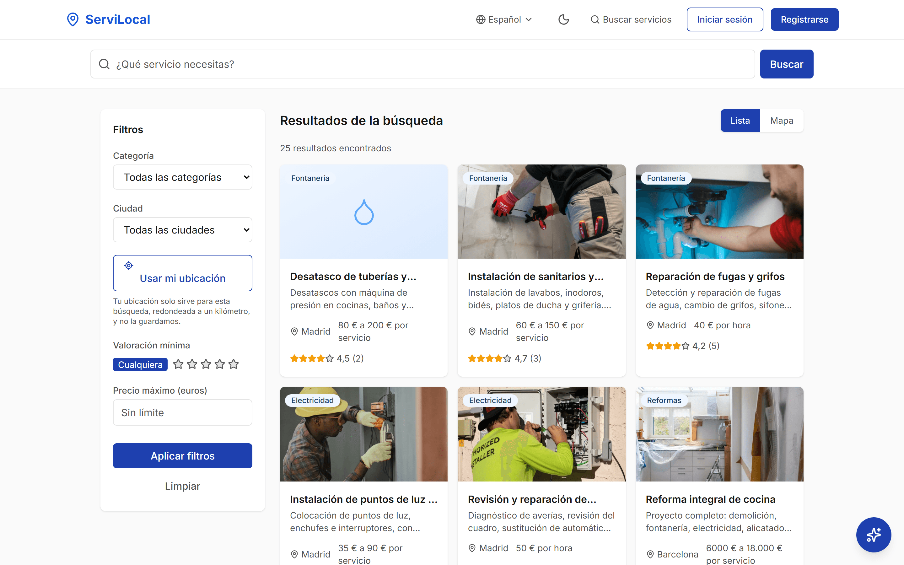 | 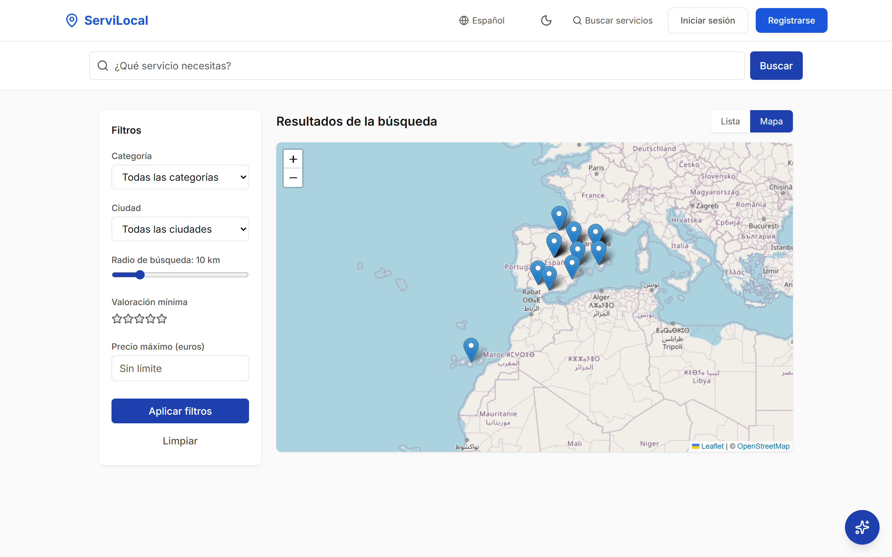 |

| Dark mode | Arabic, right to left |
|---|---|
|  | 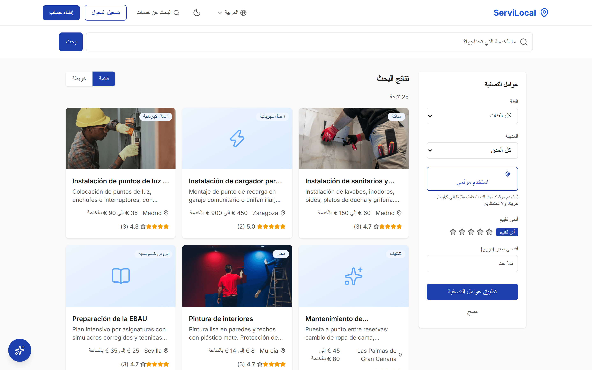 |

| Service detail | Search assistant, here on its dictionary path with no model key |
|---|---|
| 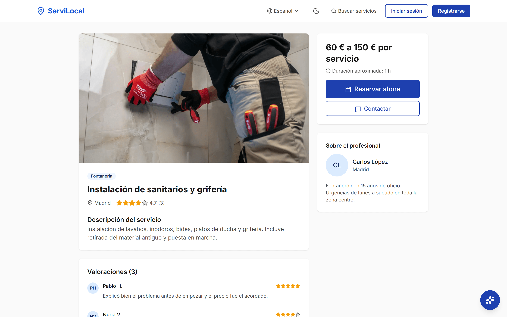 | 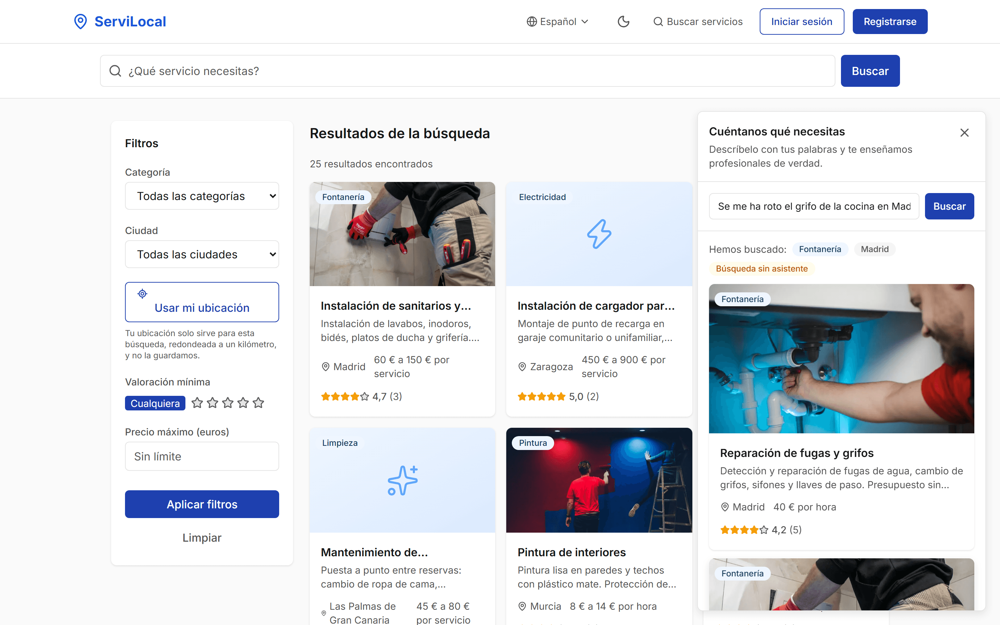 |

| Client — a confirmed booking | Provider — incoming bookings |
|---|---|
| 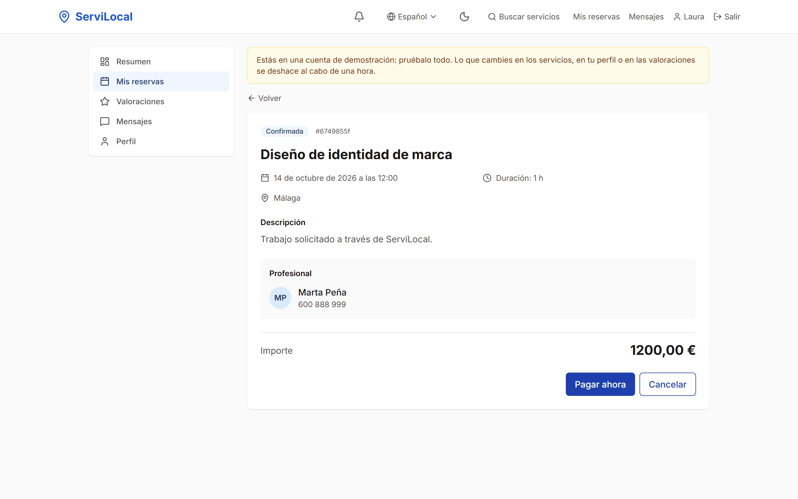 | 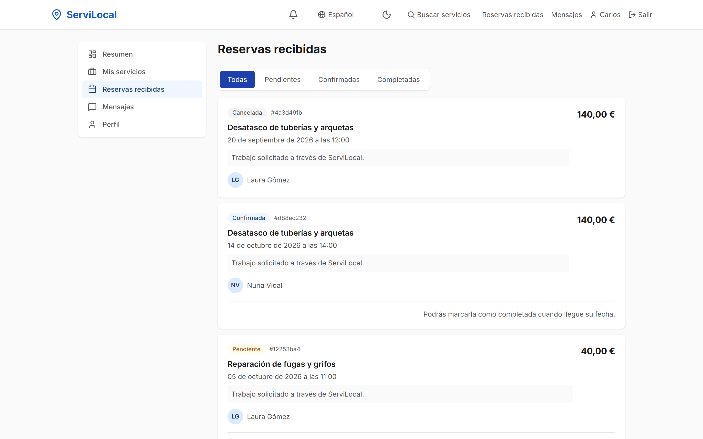 |

| Messages | One-click demo access |
|---|---|
| 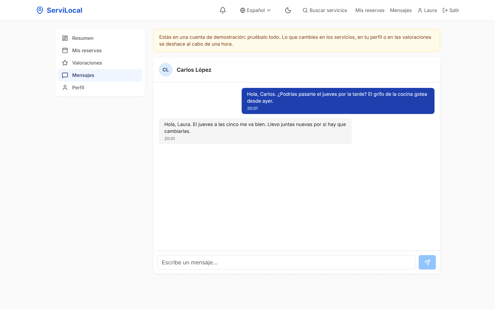 | 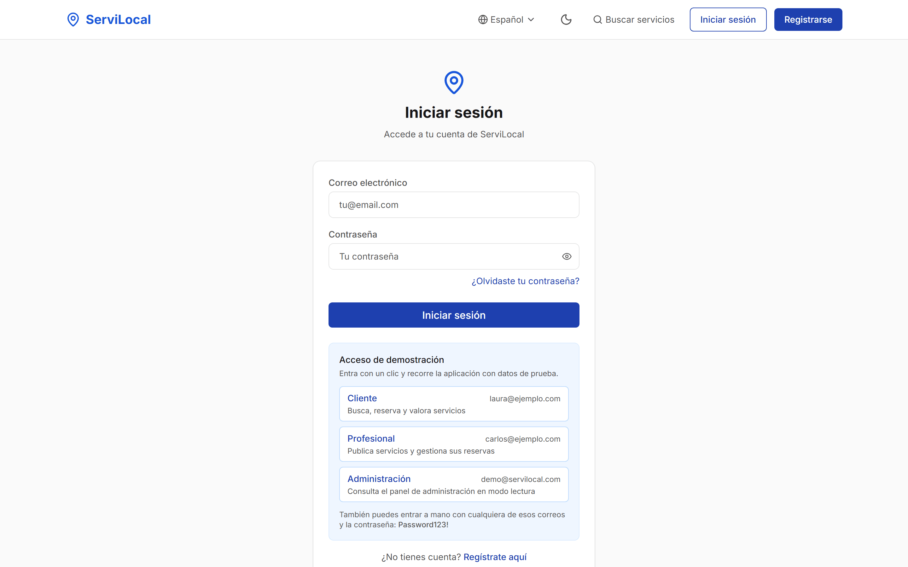 |

| Administration — metrics, reputation and audit log |
|---|
| 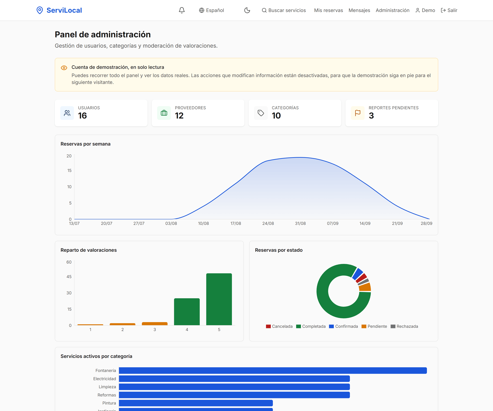 |

| Mobile — search | Mobile — service detail |
|---|---|
| 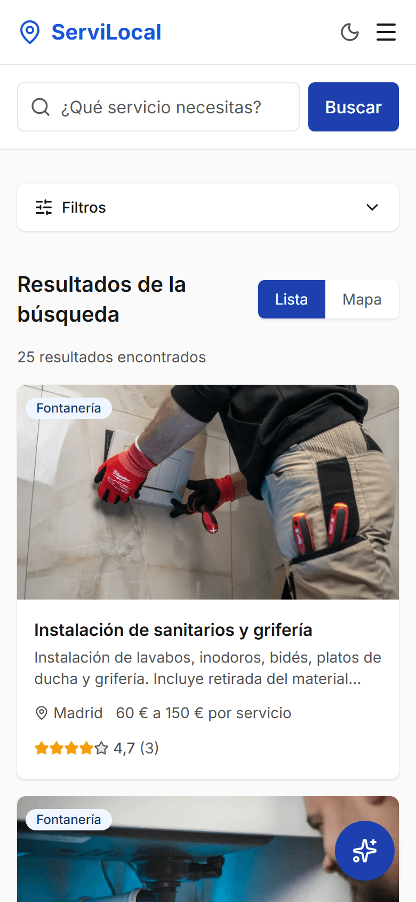 | 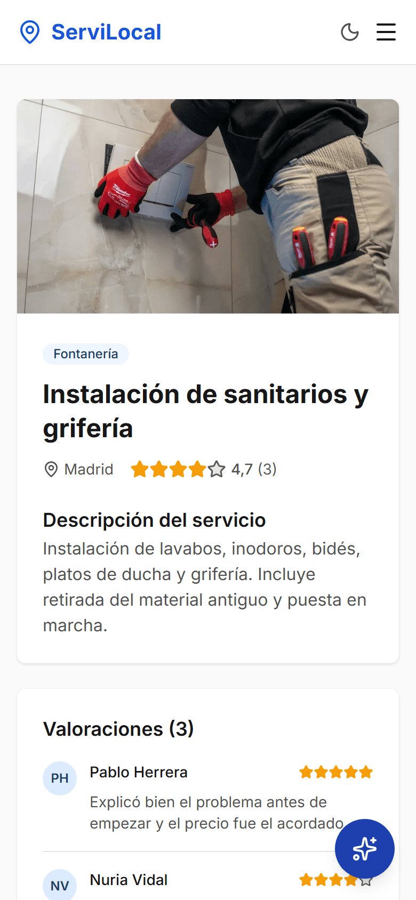 |

---

## Features

**Anyone**
- Search near you, from the browser's location, or by city, with filters: category, radius, minimum rating, maximum price. Filters, view and page live in the address, so the back button and a shared link give the same search, and the page arrives rendered from the server
- Results as a list or on a Leaflet map with markers
- Accent- and case-insensitive search that also matches trade names, so "fontaneria" finds *Fontanería*
- Service detail with verified reviews, price range and provider profile; on a phone, the price and "Book" come before the reviews
- Light and dark themes: follows the system preference, and remembers an explicit choice
- Available in 10 languages, picked from the browser and switchable at any time, right-to-left layout included; amounts are written as each language writes them

**Clients**
- Booking form with validation, dates handled in ISO UTC to avoid timezone drift; past dates, dates more than a year ahead and slots the provider has already committed are refused
- Payment through Stripe Payment Element using **manual capture**: funds are held, not taken, until the job is done, and the hold is renewed before Stripe drops it
- Bookings filtered by status, with cancellation where allowed; cancelling asks first and can carry a reason for the other party. Once the time of a confirmed booking has passed, only the provider can cancel it
- A request the provider leaves unanswered until its date expires on its own, and the hold is released
- Reviews — only after a completed booking, so ratings reflect real work
- Direct messaging with providers

**Providers**
- Full CRUD over published services, including coverage radius, price unit and how long each booking takes; a service with booking history is withdrawn rather than deleted
- Incoming bookings with confirm, reject, complete and cancel actions. Two confirmed bookings never overlap, a booking is completed once its date has arrived, and completing one with nothing held asks whether to wait for the payment or complete it without charge
- Messaging with clients
- Replies to reviews, from the service's own page

**Everyone with an account**
- Change the password from the profile, which closes every other session, or recover it by email with a one-hour link
- Download everything the platform keeps about you as a file, and delete the account: personal data and the saved card are erased, and what other people's history needs stays without your name
- If the session expires while you are writing, sending says so, takes you to sign in and back, and keeps what you wrote

**Administrators**
- Protected by JWT guards plus a role guard
- User management: list, filter by role and status, activate or deactivate
- Hierarchical category management
- Moderation queue for reported reviews
- Basic platform metrics

---

## Tech Stack

| Layer | Technology |
|-------|-----------|
| Front end | React 19, Next.js 16 (App Router, Turbopack), TypeScript |
| Styling | Tailwind CSS with semantic colour tokens, Atomic Design component structure |
| Internationalisation | next-intl, 10 locales with per-locale static generation, ICU plurals, `hreflang` alternates and RTL support |
| Back end | NestJS, TypeScript |
| Database | PostgreSQL with PostGIS (schema managed by TypeORM migrations) |
| ORM | TypeORM, with a numeric transformer for decimal columns |
| Maps | Leaflet + react-leaflet, dynamically imported to avoid SSR issues |
| Auth | JWT with Passport, bcrypt password hashing |
| Payments | Stripe Payment Element, manual capture, signed webhook |
| Component catalogue | Storybook 10, with locale and theme switchers in the toolbar |
| Observability | Sentry for unhandled errors, `/api/health` with a real database probe, and a request id on every response, every log line of that request and every Sentry report — error screens show it as a reference code |
| AI layer | Anthropic SDK behind a one-method interface, with a null provider, persisted usage accounting and a hard monthly spend ceiling |
| Real-time messaging | Socket.IO gateway with one private room per person. Clients never ask to join a room: the server puts each connection in its own and emits to both participants of a conversation, which it reads from the stored conversation. HTTP polling stays as a fallback while the socket is down |
| Redis, optional | Rate-limit counters, the Socket.IO adapter and a read cache. Every one of them degrades on its own: with no `REDIS_URL` the app behaves exactly as it did before Redis existed, and if Redis goes down mid-flight the API keeps serving — the counter stops counting, the cache falls through to PostgreSQL. A cache must never become a single point of failure |
| Admin dashboard | Every figure comes from a SQL aggregation, never from counting rows in the browser. Charts with Recharts, theme-aware through the same CSS variables as the rest of the UI. The weekly series fills empty weeks server-side, so the line never joins two distant dates as if they were adjacent |
| Testing | Vitest on both sides, because NestJS 12 and `next-intl` both ship ESM only: 1021 unit tests on the API with doubles, plus 426 integration tests against a real PostGIS database, Stripe's official `stripe-mock` and Valkey — most of them a matrix that boots the whole application and calls every route as every kind of account — and 835 in the browser. Playwright for 104 end-to-end tests, each run in Chrome on desktop and on a phone, in Firefox and in Safari's WebKit, and `@axe-core/playwright` for WCAG checks in both themes |
| CI | GitHub Actions on every push to any branch: lint, type-check, unit and integration tests, build, component catalogue, end-to-end, a gate on known vulnerabilities in production dependencies, secret scanning over the whole history, and building and booting the Docker images. CodeQL static analysis on `main` and weekly; Dependabot for updates. After every deploy, a smoke test waits for each service to serve the new commit and then checks production end to end: the proxy, the cookie, the socket and sign-out |
| Hosting | Render (web services) + Neon (PostgreSQL) |

---

## Architecture

Three-tier client–server. The front end consumes the REST API; the API persists to PostgreSQL/PostGIS and integrates with Stripe.

```
┌──────────────────┐        HTTPS / JSON      ┌──────────────────┐
│    Next.js 16    │ ───────────────────────► │     NestJS 12    │
│    App Router    │ ◄─────────────────────── │     REST API     │
│    10 locales    │                          │    JWT + Roles   │
└──────────────────┘                          └────────┬─────────┘
         │                                             │
         │ Stripe Payment Element              TypeORM │ migrations
         ▼                                             ▼
┌──────────────────┐     signed webhook       ┌──────────────────┐
│      Stripe      │ ───────────────────────► │    PostgreSQL    │
│  manual capture  │                          │    + PostGIS     │
└──────────────────┘                          └──────────────────┘
```

The UML diagrams in [`diagrams/`](diagrams/) are the ones submitted with the thesis (1.0.0) and are kept as they were; the data model has grown since, and its current shape is in [`ARCHITECTURE.md`](ARCHITECTURE.md#data-model). Responsive wireframes live in [`wireframes/`](wireframes/). Both are standalone HTML.

**[`ARCHITECTURE.md`](ARCHITECTURE.md)** goes further: the request lifecycle, the module and data maps, the decisions behind each fork in the road, and the limitations that were accepted on purpose.

---

## Engineering Highlights

- **Spatial search** uses PostGIS `ST_DWithin` against GiST-indexed geometry columns, not a bounding-box approximation.
- **Text and city matching** is accent-insensitive through an `IMMUTABLE` SQL expression, backed by a functional index so it stays indexable.
- **Payments use manual capture**, so the client's money is authorised at booking time and only captured when the work is confirmed — the correct model for a marketplace. Each status change runs in one transaction with the booking locked, so a provider completing while the client cancels can no longer leave a cancelled booking charged.
- **The calendar is enforced by the database.** An exclusion constraint over the provider and the booked interval keeps confirmed bookings from overlapping, even when two are confirmed at the same instant and neither request can see the other.
- **The webhook verifies Stripe's signature** against the raw request body, which is why the Nest app boots with `rawBody: true`.
- **Reviews require a completed booking**, one review per booking, enforced by a unique constraint. That rules out drive-by ratings from people who never hired anything. It does not make collusion impossible — a provider with a second account can still book their own service through it — so treat it as a cost raised, not a guarantee.
- **The API client retries idempotent reads only.** A timed-out `GET` is retried once; a `POST` never is, because repeating one could duplicate a booking or a charge.
- **`/api/health` checks the database, not just the process.** An API that boots but cannot reach its database is down in practice — exactly the failure this project had, unnoticed, for four months. It returns `503` when the database does not answer, so a monitor can actually detect it.
- **Dark mode uses semantic tokens, not a second set of classes.** Components name the role of a colour (`bg-superficie`, `text-principal`), never the colour itself. The theme is applied by a blocking inline script before first paint, so there is no flash of the wrong theme.
- **Ten languages, statically generated.** Every page is prerendered once per locale rather than translated in the browser, so a crawler and a first-time visitor get the same HTML. The locale comes from the URL, each page declares `hreflang` alternates plus `x-default`, and Arabic flips `dir` to `rtl` at the document root. Catalogues are checked for key parity against Spanish, so a missing translation is caught before it ships rather than showing as a blank label in production. Every screen is covered, dashboard and admin panel included; the terms and privacy texts stay in Spanish on purpose, with a notice in the reader's language saying the Spanish version is the one that prevails.
- **The component catalogue renders components the way the app does.** Stories run inside the same locale provider and theme tokens as the application, and the toolbar switches both, so a card can be checked in Arabic on a dark background without starting the API. CI builds the catalogue on every push, because a broken story breaks nothing in production and would otherwise rot unnoticed.
- **The spend ceiling is asked before spending, not measured after.** Usage is accumulated in PostgreSQL with an `ON CONFLICT DO UPDATE`, never in process memory: on a free tier the instance sleeps several times a day, so an in-memory counter resets with it and a ceiling built on one only looks like a ceiling. Failed calls are recorded too — a call that timed out still cost latency, and one that appears nowhere is one nobody notices. Costs are integer cents, computed from the token counts the provider returns rather than estimated.
- **No API key means no AI, not no application.** The provider is chosen once, by injection: with a key it is the real one, without it a null provider that fails immediately with a typed cause so the caller takes its deterministic path. The app logs which one it got, next to the equivalent line for Sentry. Nothing in the layer throws at boot.
- **The assistant is measured, not assumed.** A set of 48 messages in the ten interface languages — trades named outright, symptoms instead of trades, no accents, cities with no coverage, a negation and two prompt injections — each with the category and city it should yield. The dictionary path runs against it on every push and must resolve every case it is meant to, inventing nothing beyond one known confusion; the model path goes through the same prompt and the same catalogue validation as production, and is run by hand (`npm run evaluar:ia`, or from the Actions tab) because every case is a paid call. Getting it wrong is scored apart from coming up short: a wrong category narrows the search onto something nobody asked for.
- **The rate limiter keys on the visitor, and it was measured rather than assumed.** `trust proxy: 1` made `req.ip` the last entry of `X-Forwarded-For`, which on Render is an internal load balancer — and it changes between requests, so one visitor landed in two counters while everyone behind the same balancer shared a third. Reading `X-Forwarded-For` directly is worse: Cloudflare **concatenates** rather than sanitises, so position 0 is whatever the client claims. The key is `CF-Connecting-IP`, which cannot be forged — send it yourself and Cloudflare answers 403 at the edge. Raising `trust proxy` to 3 also works today, and was rejected: it depends on there being exactly two infrastructure hops, which Render documents nowhere.
- **Lock files are generated on Linux, not on the development machine.** npm resolves peer dependencies differently per operating system: `next-intl` pulls in `@swc/core`, which declares `@swc/helpers >=0.5.17` as an optional peer while Next pins `0.5.5` exactly, and Storybook brings the same clash with `ajv`. Linux resolves each into two entries, Windows into one, and `npm ci` rejects the Windows tree outright. `npm run lock` rebuilds the tree inside a `node:22` container and refuses to write the file until `npm ci` accepts it. The images install with `npm ci` too — they used to run `npm install`, which can resolve a different tree, so all of that work stopped at the CI boundary and never reached what actually gets deployed. CI now builds both images on every push and checks three things about the API one: that it does not run as root, that the source tree is not inside it, and that the build tooling was left behind.

---

## Getting Started

### Prerequisites

- Node.js 22.22.3 or newer. The API itself runs on 22.12+, but the NestJS 12 CLI used to build it needs the later release
- Docker and Docker Compose
- A Stripe account in test mode (publishable and secret keys)

### Everything in Docker

The quickest way to see it running: the database, the API and the front end, built from
their own Dockerfiles exactly as they are deployed.

```bash
git clone https://github.com/Federicojaviermartino/servilocal.git
cd servilocal
docker compose up --build
docker compose exec -e SEMILLA_CONFIRMAR=servilocal api node dist/database/seeds/run-seed.js
```

Then open http://localhost:3000 and use the demo buttons on the sign-in page. The API runs
its migrations on start; the seed empties the database before filling it, which is why it
asks for the database name. Payments need your own Stripe test keys. Compose and CI use
PostgreSQL 16 with PostGIS 3.4.

To work on the code with hot reload, run only the database in Docker and each app with npm:

### 1. Clone and start the database

```bash
git clone https://github.com/Federicojaviermartino/servilocal.git
cd servilocal
docker compose up -d db
```

### 2. Configure the back end

```bash
cp backend/.env.example backend/.env
```

The example file lists every variable the API reads, with what each one does; the
defaults work against the database above. Add your Stripe test key to try payments. See
[Configuration](#configuration) for the full list.

### 3. Install, migrate and seed

```bash
cd backend
npm install
npm run migration:run   # creates the schema, including the PostGIS extension
npm run seed            # 16 users, 10 categories, 25 services, 79 reviews
npm run start:dev
```

The seed empties the database before filling it, inside one transaction. It runs unprompted only against a local database; for any other host it stops and asks for the database name in `SEMILLA_CONFIRMAR`, so a production URL left in `.env` cannot be wiped by accident.

The API runs at `http://localhost:3001/api`, with interactive Swagger docs at `/api/docs`.

> The schema is created **only** by migrations — `synchronize` is off in every environment, so local and production can never drift apart. In deployed environments pending migrations run automatically at boot.

### 4. Configure and start the front end

Create `frontend/.env.local` from `frontend/.env.example`:

```env
NEXT_PUBLIC_API_URL=http://localhost:3001/api
NEXT_PUBLIC_STRIPE_PUBLISHABLE_KEY=pk_test_...
```

Both example files list every variable the code actually reads, with a note on
each saying what happens without it. `NEXT_PUBLIC_*` values are inlined at
build time and end up in the browser, so the Stripe key on this side is the
publishable one — never the secret.

```bash
cd frontend
npm install
npm run dev
```

The app runs at `http://localhost:3000`.

### 5. Optional — test the Stripe webhook locally

```bash
stripe listen --forward-to localhost:3001/api/payments/webhook
```

Copy the `whsec_...` it prints into `STRIPE_WEBHOOK_SECRET` and restart the back end.

---

## Project Structure

```
servilocal/
  backend/                  NestJS + TypeORM + PostgreSQL/PostGIS + Stripe
    src/
      auth/                 JWT authentication with Passport
      users/                User management
      categories/           Hierarchical categories
      services/             Services with geospatial search (ST_DWithin)
      bookings/             Bookings and their state machine
      reviews/              Reviews tied to completed bookings
      payments/             Stripe integration, manual capture
        payments-webhook.controller.ts    Signature-verified webhook
      messages/             Direct messaging between users
      notifications/        Persisted notices, pushed over the socket
      auditoria/            Append-only record of administration actions
      admin/                SQL aggregations for the dashboard
      ia/                   Optional assistant, with a monthly spend ceiling
      health/               Liveness probe backed by a real query
      entities/             TypeORM entities
      common/               Guards, filters, interceptors, Redis and the
                            real-time gateway
      config/               Database config and CLI data source
      database/
        migrations/         Schema history — the only source of truth
        seeds/              Reproducible demo data
  frontend/                 Next.js 16 App Router + Tailwind
    .storybook/             Component catalogue config and sample data
    e2e/                    Playwright specs, desktop and mobile projects
    messages/               Translation catalogues, one JSON per locale
    scripts/                capturas.mjs, which takes the screenshots in this README
    src/
      app/
        [locale]/           Every route, prerendered once per language
        robots.ts, sitemap.ts
      i18n/                 Locale list, localised navigation, per-request config
      proxy.ts              Locale detection and prefixing, and the relay of /api to the API
      components/
        atoms/              Button, Input, Badge, Avatar, Spinner
        molecules/          SearchBar, ServiceCard, SelectorTema, SelectorIdioma, Pagination
        organisms/          FilterPanel, ResultsList, ServiceMap, forms
        templates/          DashboardLayout
        layout/             Header, Footer
      lib/                  API client, auth store (Zustand), Stripe, shared constants
      types/                Shared TypeScript types
  diagrams/                 UML diagrams as submitted with the thesis (Mermaid)
  wireframes/               Responsive wireframes
  scripts/                  Smoke and load tests, dependency audit, CI summaries and
                            lock file regeneration inside Linux
  docs/OPERATIONS.md        Deploying, rolling back, restoring and watching production
  docs/screenshots/         Images used in this README
  docker-compose.yml
```

---

## API Reference

Interactive documentation is generated with OpenAPI and served at **[`/api/docs`](https://servilocal-api.onrender.com/api/docs)**. Every route answers under `/api/v1/…` and, for clients written before versioning, under `/api/…` as well. *JWT* means any signed-in account; a role means that role only.

**Session and account**

| Method | Endpoint | Auth | Description |
|--------|----------|------|-------------|
| `POST` | `/auth/register` | — | Create a client or provider account, with consent recorded, and open a browser session |
| `POST` | `/auth/login` | — | Open a browser session: sets an `HttpOnly` cookie, returns the user but not the token |
| `POST` | `/auth/token` | — | Obtain a bearer JWT, for Swagger, scripts and tests. No cookie |
| `POST` | `/auth/logout` | — | Delete the session cookie and revoke that session on the server |
| `GET` | `/auth/profile` | JWT | Current user, resolved from the token |
| `GET` | `/auth/socket-ticket` | JWT | One-minute ticket for the Socket.IO handshake, refused as a session |
| `POST` | `/auth/cambiar-contrasena` | JWT | Change the password; closes every other session |
| `POST` | `/auth/recuperar` · `/auth/restablecer` | — | Password recovery by email, with a one-hour, single-use link |
| `GET` `PUT` | `/users/me` · `/users/profile` | JWT | Read and edit your own profile |
| `GET` | `/users/me/datos` | JWT | Download all your data as JSON |
| `POST` | `/users/me/eliminar` | JWT | Delete your account, anonymising what other people's history needs |

**Services and categories**

| Method | Endpoint | Auth | Description |
|--------|----------|------|-------------|
| `GET` | `/services/search` | — | Geospatial search with filters and pagination |
| `GET` | `/services/:id` | — | Service detail |
| `GET` | `/services/provider/:providerId` | — | Services published by one provider |
| `GET` | `/services/mine` | Provider | Your own services, with the reference address that public routes leave out |
| `POST` | `/services` | Provider | Publish a service |
| `PUT` `DELETE` | `/services/:id` | Provider | Edit or remove your own service; one with bookings is withdrawn, not deleted |
| `GET` | `/categories` · `/categories/:id` | — | Hierarchical category tree, and one category |
| `POST` | `/categories` | Admin | Create a category |
| `PUT` `DELETE` | `/categories/:id` | Admin | Edit or delete a category |

**Bookings and payments**

| Method | Endpoint | Auth | Description |
|--------|----------|------|-------------|
| `POST` | `/bookings` | Client | Create a booking |
| `GET` | `/bookings/my` | JWT | Your bookings as a client |
| `GET` | `/bookings/received` | Provider | Bookings on your services |
| `GET` | `/bookings/:id` | JWT | One booking, to either party |
| `PATCH` | `/bookings/:id/status` | JWT | Advance the booking state machine, with an optional reason when cancelling or rejecting |
| `POST` | `/payments/create-intent` | Client | Payment intent with manual capture |
| `POST` | `/payments/confirm/:paymentIntentId` | JWT | Confirm with Stripe, not with the browser, that the funds are held |
| `GET` | `/payments/my` · `/payments/booking/:bookingId` | JWT | Your payments, and the payment of a booking |
| `POST` | `/payments/capture/:bookingId` | Admin | Capture held funds of a completed booking; recorded in the audit log |
| `POST` | `/payments/refund/:bookingId` | Admin | Refund a closed booking; recorded in the audit log |
| `POST` | `/payments/webhook` | Signature | Stripe events, verified against the raw body |

**Reviews, messages and notifications**

| Method | Endpoint | Auth | Description |
|--------|----------|------|-------------|
| `GET` | `/reviews/service/:serviceId` | — | Reviews for a service |
| `GET` | `/reviews/my` | JWT | Reviews you have written |
| `POST` | `/reviews` | Client | Review a completed booking |
| `PATCH` | `/reviews/:id/response` | Provider | Public reply to a review |
| `PATCH` | `/reviews/:id/report` | JWT | Report a review |
| `GET` | `/reviews/reported` | Admin | Moderation queue |
| `PATCH` `DELETE` | `/reviews/:id/dismiss-report` · `/reviews/:id` | Admin | Keep a reported review, or delete it |
| `POST` | `/messages` | JWT | Start a conversation |
| `GET` | `/messages/conversations` · `/messages/conversation/:partnerId` | JWT | Your conversations, and one thread |
| `PATCH` | `/messages/conversation/:partnerId/read` | JWT | Mark what that person sent you as read |
| `POST` | `/messages/conversation/:conversationId` | JWT | Reply in a thread |
| `GET` | `/messages/unread/count` | JWT | Unread messages |
| `GET` | `/notifications` · `/notifications/unread/count` | JWT | Your notifications |
| `PATCH` | `/notifications/:id/read` · `/notifications/read-all` | JWT | Mark one or all as read |

**Administration, assistant and health**

| Method | Endpoint | Auth | Description |
|--------|----------|------|-------------|
| `GET` | `/users` · `/users/:id` | Admin | User administration |
| `PATCH` | `/users/:id/toggle-active` | Admin | Activate or deactivate an account; recorded in the audit log |
| `GET` | `/admin/metricas` · `/admin/reputacion` | Admin | Aggregated metrics and provider reputation, computed in SQL |
| `GET` | `/admin/auditoria` | Admin | Audit log, paginated |
| `POST` | `/ia/asistente` | — | Natural-language search, with or without the model |
| `GET` | `/ia/estado` · `/ia/consumo` | — · Admin | Whether the assistant is available, and its spending |
| `GET` | `/health` | — | Health, with a real database probe: `503` when the database does not answer |
| `GET` | `/health/vivo` | — | Liveness only, without touching the database: what the keep-awake ping calls |

---

## Configuration

**API (`servilocal-api`)**

| Variable | Description |
|----------|-------------|
| `DATABASE_URL` | Postgres connection string with SSL |
| `NODE_ENV` | `production` |
| `JWT_SECRET` | Secret used to sign JWTs |
| `JWT_EXPIRATION` | For example `7d` |
| `STRIPE_SECRET_KEY` | Stripe secret key |
| `STRIPE_WEBHOOK_SECRET` | Endpoint signing secret from the Stripe dashboard |
| `CORS_ORIGINS` | Comma-separated list of allowed origins. State-changing requests from any other `Origin` are rejected |
| `PROXY_SECRETO` | Shared with the front end, at least 32 characters (`openssl rand -hex 32`). Lets the API trust the visitor address the front end relays; without it, everything relayed shares one rate-limit bucket |
| `SENTRY_DSN` | Optional. Without it, error reporting stays off and the app boots normally |
| `BREVO_API_KEY`, `CORREO_REMITENTE` | Optional. Brevo key and verified sender for password-recovery emails (`CORREO_REMITENTE_NOMBRE` sets the display name). Without them, outside production the email goes to the server log; in production the API answers that recovery is unavailable |
| `FRONTEND_URL` | Optional. Where the links in emails point; defaults to the first of `CORS_ORIGINS` |
| `THROTTLE_AUTH_LIMIT` | Optional. Raises the login rate limit in test environments |
| `THROTTLE_RESERVAS_LIMIT`, `THROTTLE_MENSAJES_LIMIT` | Optional. Raise the per-minute limits on creating bookings (10) and sending messages (30) in test environments |
| `THROTTLE_SERVICIOS_LIMIT` | Optional. Raises the limit on publishing services, 20 an hour per visitor, in test environments |
| `ANTHROPIC_API_KEY` | Optional. Without it the AI layer stays inactive and the app boots normally |
| `RETENCIONES_AUTOMATICAS` | Optional. `false` turns off the hourly jobs that move money on their own: renewing payment holds, reconciling payments with Stripe and expiring requests left unanswered |
| `RESTAURAR_DEMOSTRACION` | Optional. `false` turns off the hourly job that puts back what the demo accounts changed more than an hour earlier. It never runs with `NODE_ENV=test` |
| `IA_ACTIVA` | Optional. `false` turns the AI layer off even when a key is present |
| `IA_MODELO` | Optional. Defaults to `claude-haiku-4-5-20251001` |
| `IA_TOPE_MENSUAL_CENTIMOS` | Optional. Hard monthly ceiling in cents, checked before every call. Defaults to `100` (1 €) |
| `DB_SSL_PERMISIVO` | Optional. `true` accepts a database certificate that cannot be verified, for providers with a self-signed one. Off by default |
| `PORT` | Optional. Defaults to `3001`; Render sets it |
| `THROTTLE_LIMIT` | Optional. The general per-visitor limit, 120 requests a minute by default |
| `IA_MAX_TOKENS_SALIDA`, `IA_TIEMPO_ESPERA_MS` | Optional. Output ceiling per call and how long to wait for the model |
| `SENTRY_TRACES_SAMPLE_RATE` | Optional. Share of requests traced, between 0 and 1; `0.1` by default |
| `DIAGNOSTICO_TOKEN` | Optional. Turns on `GET /api/diagnostico/ip`, which shows how many proxies sit in front of the API. Set it, measure, remove it |
| `ADMIN_PASSWORD`, `ADMIN_EMAIL` | Seed only. Without `ADMIN_PASSWORD` the seed creates just the read-only demo administrator |
| `REDIS_URL` | Optional. Without it the rate limiter counts in memory, sockets stay on one instance and nothing is cached. On Render, create a free Key Value instance **in the same region as the API** (the private network does not cross regions) and copy its internal URL. Recommended eviction policy: `allkeys-lru` |

**Front end (`servilocal-web`)**

| Variable | Description |
|----------|-------------|
| `NEXT_PUBLIC_API_URL` | Public URL of the API, including `/api`. The browser calls `/api` on the front end, which relays it here; the socket connects to it directly |
| `PROXY_SECRETO` | Same value as on the API. Read at runtime, never sent to the browser |
| `NEXT_PUBLIC_STRIPE_PUBLISHABLE_KEY` | Stripe publishable key |
| `NEXT_PUBLIC_SITE_URL` | Canonical site URL for `sitemap.xml` and Open Graph |
| `API_INTERNA` | Optional. Where the front end's own server reaches the API, when that is not the public address: inside Docker Compose it is `http://api:3001/api`. Read at runtime |

Every variable is checked when the API boots: a required one that is missing, a number that is not a number or an origin with a path stops it with the list of problems, and a deploy that does not start never replaces the running one. See [`docs/OPERATIONS.md`](docs/OPERATIONS.md).

`NEXT_PUBLIC_*` variables are injected as Docker build args, because Next.js inlines them at build time. After changing one, redeploy with **Clear build cache** — a restart is not enough.

---

## Deployment

The deployed demo uses:

- **Neon** for PostgreSQL with PostGIS — a free tier that does not expire after 30 days, unlike the alternatives.
- **Render** for two web services, each built from its own Dockerfile: the NestJS API and the Next.js front end.
- **GitHub Actions** for CI and for a scheduled job that keeps both services awake during working hours.

The Render services are described in [`render.yaml`](render.yaml), and deploying, rolling back, restoring the database and rotating secrets are written down step by step in [`docs/OPERATIONS.md`](docs/OPERATIONS.md).

### Stripe webhook

Register `https://servilocal-api.onrender.com/api/payments/webhook` in the Stripe dashboard for these events:

- `payment_intent.amount_capturable_updated` — records the funds as held; accepting the booking is still the provider's call. If the booking was cancelled meanwhile, the hold is released at once; if it was completed without charge, it is captured
- `payment_intent.succeeded` — completes the payment
- `payment_intent.payment_failed` — records why the card was declined; the payment stays pending, because the client can retry with another card in the same form
- `payment_intent.canceled` — marks the payment failed; if Stripe dropped a hold on its own, the client is asked to authorise again and the provider is told

---

## Accessibility

WCAG 2.1 level AA, verified on every push with `@axe-core/playwright` in both
themes, plus Playwright tests for what automated tooling cannot check: keyboard
operation, focus return, the ARIA tab pattern, and reflow at 320 px.

[`ACCESSIBILITY.md`](ACCESSIBILITY.md) states what is implemented, how it is
verified and — deliberately — the known gaps, including that no audit with a real
screen reader has been done.

---

## Security

Controls implemented in the API and the front end:

| Area | Control |
|------|---------|
| Authentication | JWT with Passport in an `HttpOnly`, `Secure`, `SameSite=Lax` cookie that page scripts cannot read, kept first-party by relaying API calls through the front end. `bcrypt` password hashing, password column excluded from queries with `select: false`. Tokens carry an audience, so the socket's one-minute ticket is not a session and a session is not a ticket. Signing out revokes that session server-side, so a copied token stops working too, while other sessions of the same account stay open. Changing or recovering the password invalidates every earlier session; recovery links last an hour, work once and are stored only as a hash. Signing in reveals neither in its answer nor in its timing whether an email is registered, and the redirect after it only accepts paths of the application |
| Privacy | Data export and account deletion from the profile. Deletion anonymises the account and erases the card saved at Stripe, keeping bookings, payments and reviews without the name. Registration records when the terms were accepted and which version |
| Cross-site requests | `SameSite=Lax`, plus an `Origin` check on every state-changing request, which also stops login CSRF |
| Authorisation | Route guards by role; the role guard rejects a missing user instead of throwing a `500` |
| Input validation | Global `ValidationPipe` with `whitelist` and `forbidNonWhitelisted`; `ParseUUIDPipe` on every id parameter, so a malformed id returns `400` and never reaches the database |
| Rate limiting | `@nestjs/throttler` globally, a tighter limit on the login route, counters in Redis so a deploy does not reset them, and a tracker keyed on `CF-Connecting-IP` so the bucket belongs to the visitor and not to whichever balancer served the request. For calls relayed by the front end, the visitor address it forwards counts instead, and only when it arrives with the shared secret |
| Payments | Webhook signature verified against the raw request body; funds held with manual capture, never taken automatically |
| Transport | Content Security Policy and HSTS plus `X-Content-Type-Options`, `X-Frame-Options`, `Referrer-Policy` and `Permissions-Policy`; database connections validate the server certificate |
| Error handling | Global exception filter. A 5xx logs method, path, status code and the user id when there is one, plus the stack trace — one formatted line, not JSON. Sentry capture strips the session cookie, bearer tokens and the proxy secret from errors and performance traces, and collects no request bodies, cookies, local variables or assistant conversations, checked by a test that runs a sign-in through the real SDK |

Hardening still in progress is tracked in the [roadmap](#roadmap).

---

## Testing

```bash
# Back end
cd backend
npm run lint
npm run test          # 1021 unit tests across 72 files, all with doubles (Vitest)
npm run test:cov      # all of src; fails below 96% statements / 89% branches,
                      # or below its own floor for payments, bookings, account data and guards
npm run test:integracion   # 426 tests against a real database, stripe-mock and Valkey
npm run evaluar:ia         # the assistant against its evaluation set; needs ANTHROPIC_API_KEY, costs cents
npm run build

# Front end
cd frontend
npm run lint          # fails on any warning, not only on errors
npm run format:check  # Prettier, also enforced in CI
npm run type-check
npm run test          # 835 unit tests (Vitest)
npm run test:cov      # fails below 91% statements / 88% branches
npm run build

# End-to-end (Playwright: Chrome desktop and mobile, Firefox, Safari's WebKit)
cd frontend
npx playwright install chromium firefox webkit   # first run only
npm run e2e

# Component catalogue
cd frontend
npm run storybook

# Regenerate a lock file after changing dependencies (needs Docker)
npm run lock
```

104 end-to-end tests run on four projects — Chrome on desktop and on a Pixel 5 phone (393 px), Firefox, and Safari's WebKit, with the narrowest layouts checked at 320 px — for 416 executions per run. They cover search with accent-insensitive matching, a search page that arrives rendered from the server and keeps its page in the address, publishing a service from the provider's dashboard, pagination, city filtering, the collapsible mobile filter panel, the map, demo login, failed login, route protection, a session cookie that page scripts cannot read and that belongs to the front end's own origin, sign-out revoking the session so a copied cookie stops working, registering only after accepting the terms, changing the password, deleting the account, theme switching, language detection and switching, a service page that arrives rendered, a title and a canonical URL on every page, the admin panel including its charts, moderation queue and audit log, the booking state machine — a booking is completed only once its date arrives, and completing one with nothing held asks before closing it without charge —, live notifications, WCAG 2.1 AA checks with axe in both light and dark themes, landmarks included, and in dark mode on a service page, a form showing its errors and the client dashboard, and a full booking paid with a Stripe test card.

The payment test runs only where both Stripe test keys are present, and is skipped from the start otherwise, with the reason. With the keys set it has to pass: a payment form that does not appear is a failure, not a skip, and the test checks through the API that the money ends up held. Add `STRIPE_SECRET_KEY` and `NEXT_PUBLIC_STRIPE_PUBLISHABLE_KEY` as repository secrets to run it for real in CI.

All of these run in CI on every push, to any branch. The end-to-end job spins up the whole stack: a PostGIS container, migrations, the seed, the API and the built front end. A test that fails and then passes on a retry fails the run as well, and a stray `.only` is rejected by ESLint and, in CI, by both runners.

---

## Roadmap

| Status | Item |
|--------|------|
| Considering | Provider payouts. Funds are authorised and captured to the platform account; splitting them to the provider needs Stripe Connect |
| Considering | Machine translation of provider-written text, so the nine non-Spanish locales reach a catalogue written in Spanish. Deferred on cost — it is a paid call per listing |
| Done | Tests and operations: who may call each route checked with the whole application booted, coverage over all the code with floors of its own for money and personal data, flaky end-to-end tests failing the run, a weekly encrypted copy of the database, and a shutdown that is bounded and logged |
| Done | Front end: search rendered on the server with its page in the address, search near you, ratings and conversations that a screen reader can follow, forms that validate in the page's language, and drafts kept per account |
| Done | The demo resets itself every hour, and its administrator only sees the demo's accounts. Public pages show reviewers by first name and initial, and services without their reference address |
| Done | Redis in production: rate-limit counters survive a deploy and sockets span instances. The application still runs without it, by design |
| Done | Payments follow Stripe's own state: a card declined and replaced in the same form ends held, not failed, and payments left pending or failed are reconciled every hour |
| Done | Requests left unanswered past their date expire and release their hold |
| Done | Money loop: the provider accepts or rejects, completing captures the hold, cancelling or rejecting releases it |
| Done | Calendar: durations, no past dates, completion from the booking date, and no overlapping confirmed bookings, enforced by the database |
| Done | Account self-service: password change and recovery by email, data export and deletion, and consent recorded at registration |
| Done | Front end: API errors explained in each language from their code, drafts kept across an expired session, amounts formatted per language, a server-rendered service page, a title on every page and landmarks checked by axe |
| Done | Operations: configuration checked at boot, graceful shutdown, a log line per request, the Render services as a Blueprint and a runbook for deploying, rolling back and restoring; every page under unit test |
| Done | Payment holds renewed on the saved card before Stripe drops them; when the bank insists on the cardholder, both parties are told and the client authorises again |
| Done | Browser session in an `HttpOnly` cookie, kept first-party by relaying API calls through the front end |
| Done | Public search returns a provider projection, not the full row |
| Done | Admin metrics aggregated in SQL instead of counting arrays in the browser |
| Done | Provider-level reputation across all of a provider's services |
| Done | Natural-language search, with a monthly spend ceiling checked before each call |
| Done | Usage and budget accounting persisted in PostgreSQL rather than held in memory |
| Done | Audit log of administration actions, append-only |
| Done | Seed data across all five booking states, so the admin charts and the provider inbox have something to show |

---

## Project Context

ServiLocal is the Master's thesis project for the *Máster Universitario en Desarrollo de Sitios y Aplicaciones Web* at Universitat Oberta de Catalunya (UOC), 2025/2026.

**Author:** Federico Javier Martino

The application meets the nine assessment requirements of the course, including WCAG 2.1 level AA accessibility, role management, in-app administration and deployment to a public server. The written dissertation, self-assessment report, checklist and defence presentation were submitted through the university's platform and are not part of this repository.

---

## License

Code released under the [MIT License](LICENSE). The dissertation text is under Creative Commons Attribution–NonCommercial–NoDerivatives 3.0 Spain.
