# Diagrams

The UML diagrams and the schedule submitted with the Master's thesis (version 1.0.0), in
Spanish, as they were submitted. GitHub draws them from their Mermaid source below; the
standalone pages, [`diagramas-uml-servilocal.html`](diagramas-uml-servilocal.html) and
[`gantt-servilocal.html`](gantt-servilocal.html), draw the same source in a browser.

The data model has grown since the thesis. Its current shape is in
[`ARCHITECTURE.md`](../ARCHITECTURE.md#data-model).

- [Use cases](#use-cases)
- [Domain classes](#domain-classes)
- [Entity–relationship (database)](#entityrelationship-database)
- [System architecture](#system-architecture)
- [Deployment](#deployment)
- [Sequence: booking](#sequence-booking)
- [Sequence: payment with Stripe](#sequence-payment-with-stripe)
- [Sequence: geospatial search](#sequence-geospatial-search)
- [Sequence: JWT authentication](#sequence-jwt-authentication)
- [States: booking](#states-booking)
- [Schedule](#schedule)

## Use cases

*Diagrama de Casos de Uso*

```mermaid
graph LR
    subgraph Actores
        C((Cliente))
        P((Proveedor))
        A((Admin))
    end

    subgraph "ServiLocal - Casos de Uso"
        subgraph "Autenticación"
            CU01[CU01: Registrarse]
            CU02[CU02: Iniciar sesión]
            CU03[CU03: Editar perfil]
        end
        subgraph "Búsqueda"
            CU04[CU04: Buscar servicios por ubicación]
            CU05[CU05: Filtrar resultados]
            CU06[CU06: Ver servicio en mapa]
        end
        subgraph "Reservas"
            CU07[CU07: Solicitar reserva]
            CU08[CU08: Confirmar/Rechazar reserva]
            CU09[CU09: Completar servicio]
            CU10[CU10: Cancelar reserva]
        end
        subgraph "Valoraciones"
            CU11[CU11: Valorar servicio completado]
            CU12[CU12: Responder a valoración]
            CU13[CU13: Reportar valoración]
        end
        subgraph "Pagos"
            CU14[CU14: Pagar reserva con Stripe]
            CU15[CU15: Ver historial de pagos]
        end
        subgraph "Mensajería"
            CU16[CU16: Enviar mensaje]
            CU17[CU17: Ver conversaciones]
        end
        subgraph "Proveedor"
            CU18[CU18: Crear servicio]
            CU19[CU19: Gestionar disponibilidad]
            CU20[CU20: Ver dashboard estadísticas]
        end
        subgraph "Administración"
            CU21[CU21: Gestionar usuarios]
            CU22[CU22: Gestionar categorías]
            CU23[CU23: Moderar reseñas]
            CU24[CU24: Ver estadísticas plataforma]
        end
    end

    C --- CU01 & CU02 & CU03
    C --- CU04 & CU05 & CU06
    C --- CU07 & CU10
    C --- CU11 & CU13
    C --- CU14 & CU15
    C --- CU16 & CU17

    P --- CU01 & CU02 & CU03
    P --- CU08 & CU09 & CU10
    P --- CU12
    P --- CU16 & CU17
    P --- CU18 & CU19 & CU20

    A --- CU02
    A --- CU21 & CU22 & CU23 & CU24
```

## Domain classes

*Diagrama de Clases del Dominio*

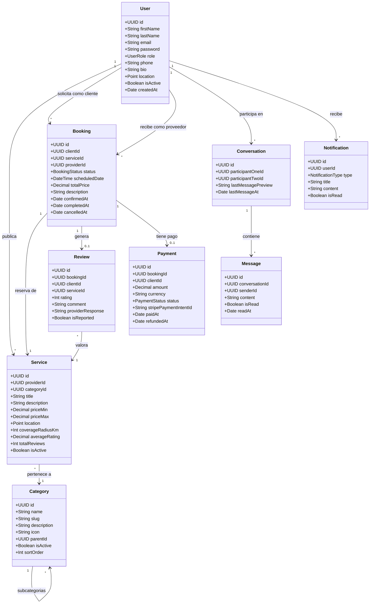

## Entity–relationship (database)

*Diagrama Entidad-Relación (Base de Datos)*

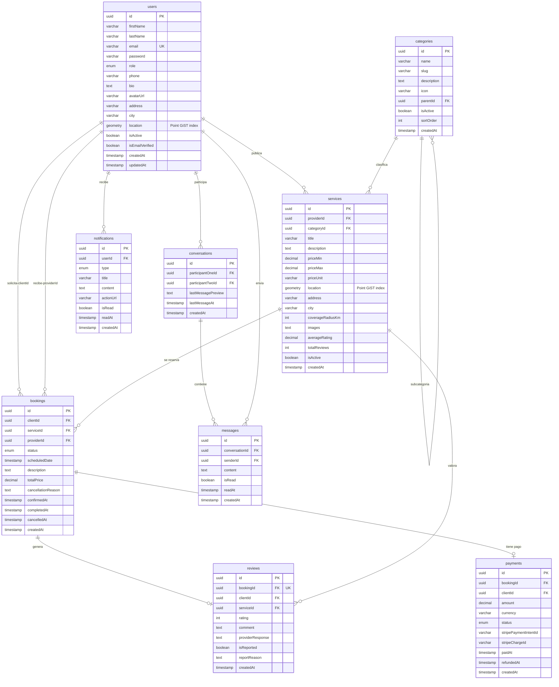

## System architecture

*Arquitectura del Sistema*

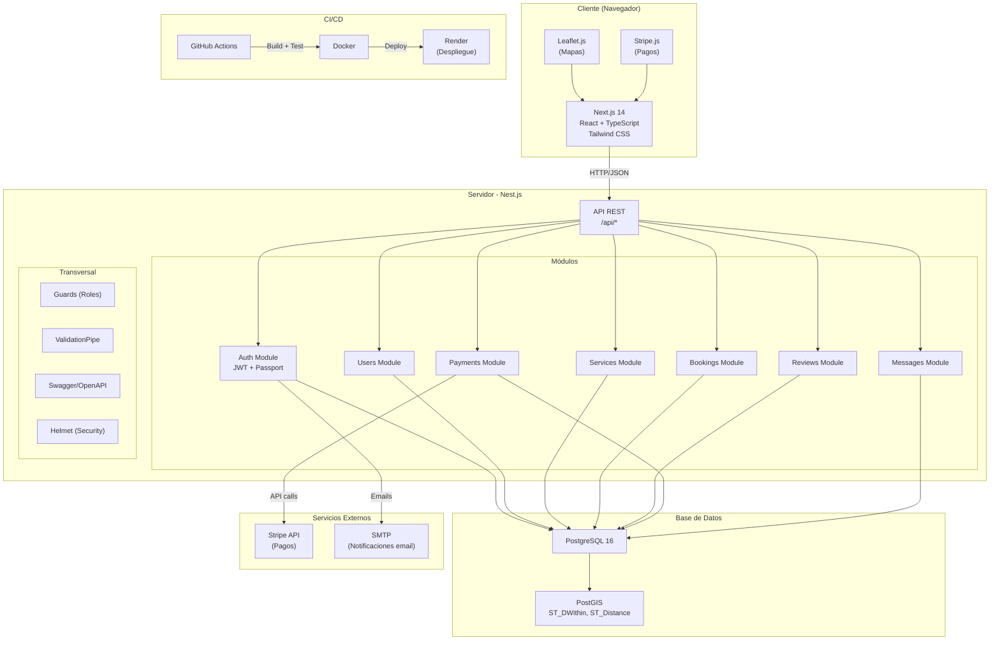

## Deployment

*Diagrama de Despliegue*

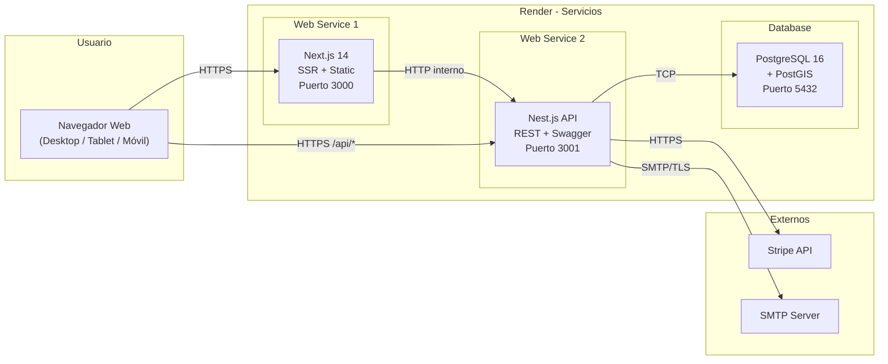

## Sequence: booking

*Diagrama de Secuencia: Flujo de Reserva*

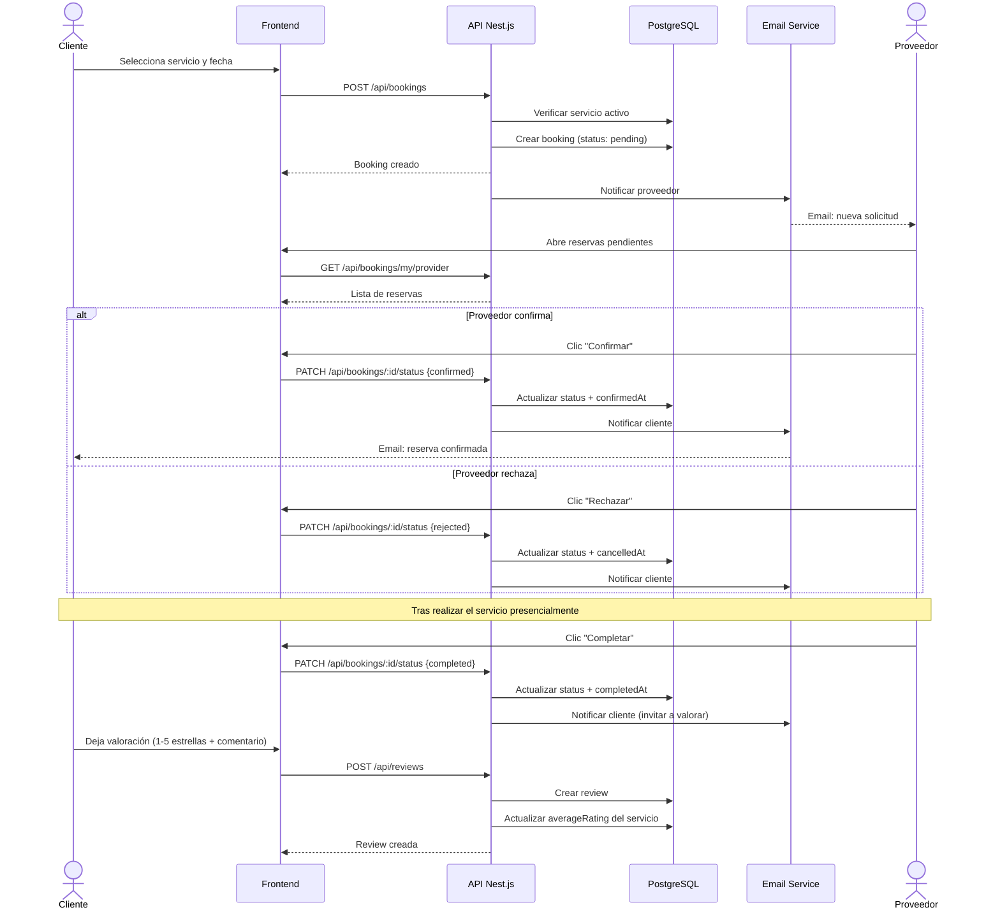

## Sequence: payment with Stripe

*Diagrama de Secuencia: Pago con Stripe*

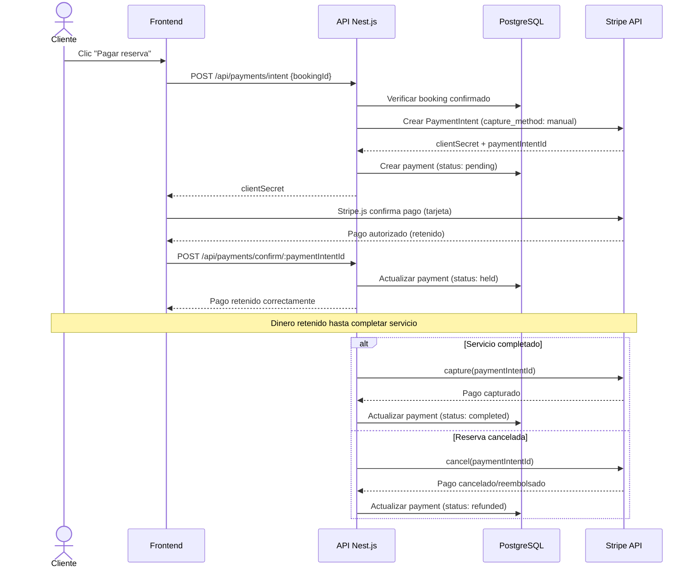

## Sequence: geospatial search

*Diagrama de Secuencia: Búsqueda Geoespacial*

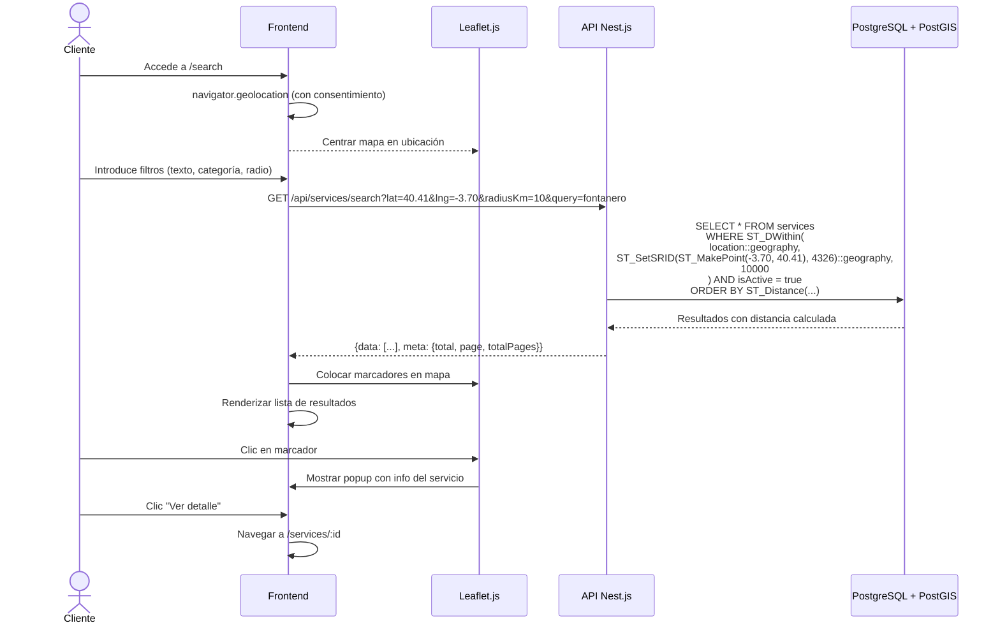

## Sequence: JWT authentication

*Diagrama de Secuencia: Autenticación JWT*

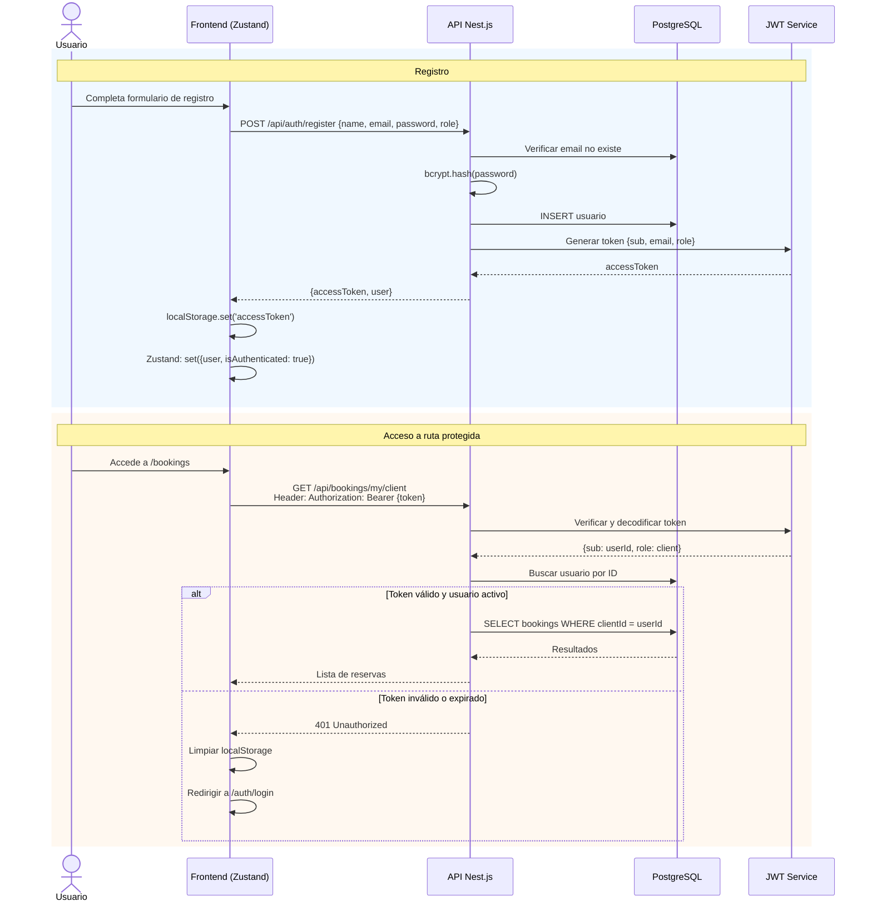

## States: booking

*Diagrama de Estados: Booking (Reserva)*

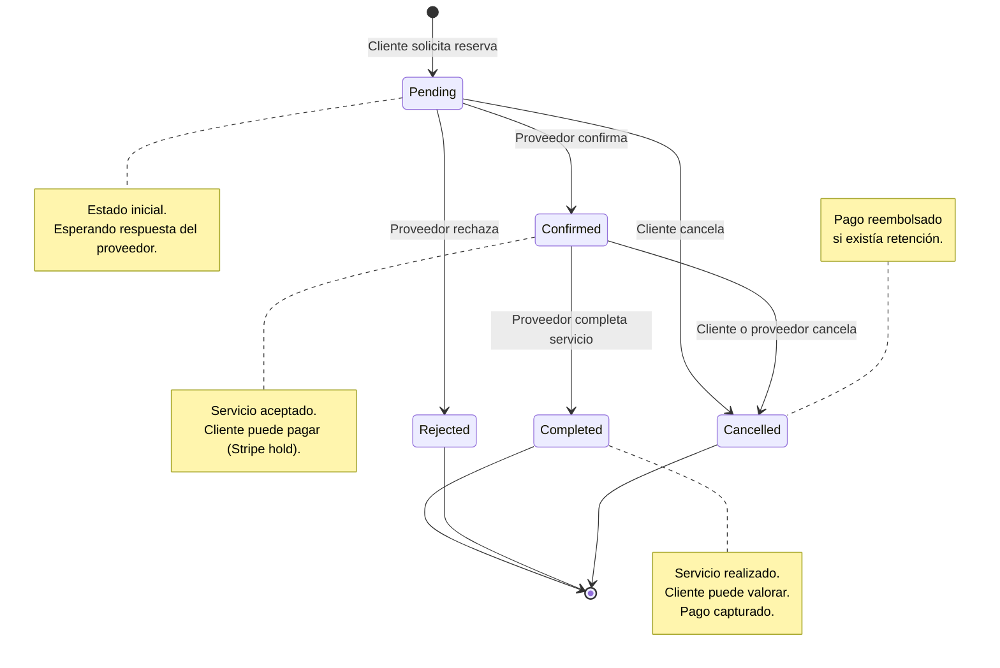

## Schedule

*Cronograma: 28 tareas en 16 semanas, 278 horas*

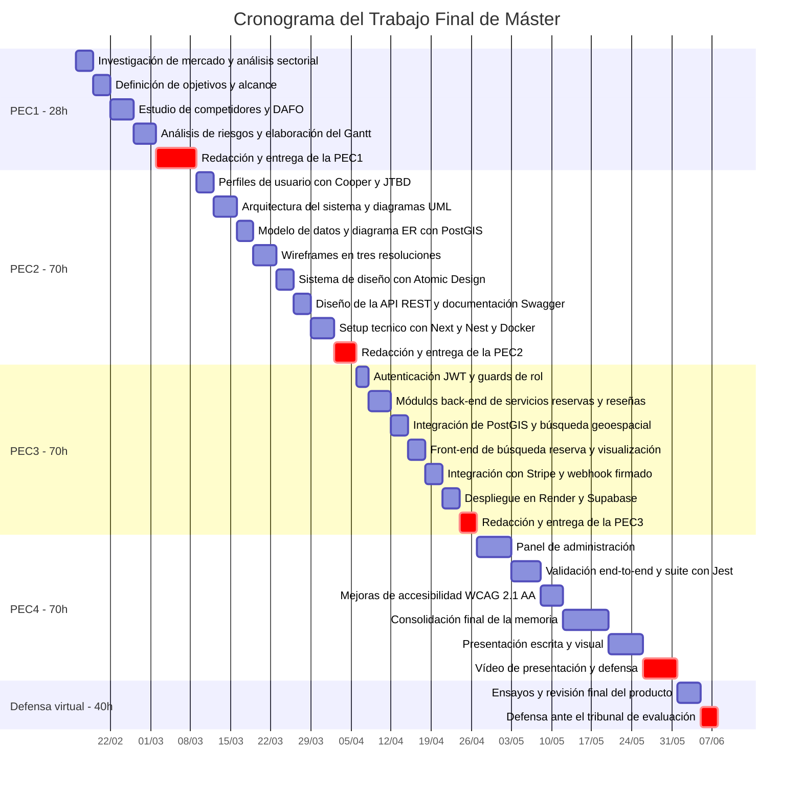
